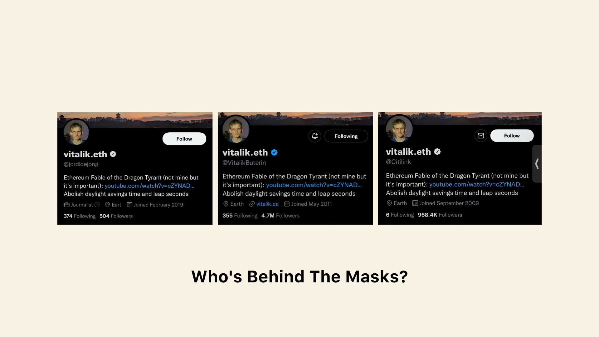
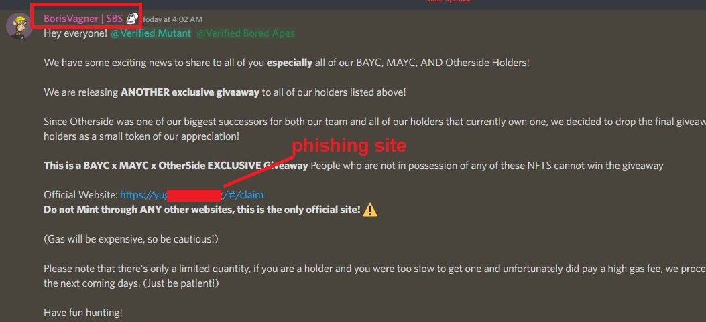
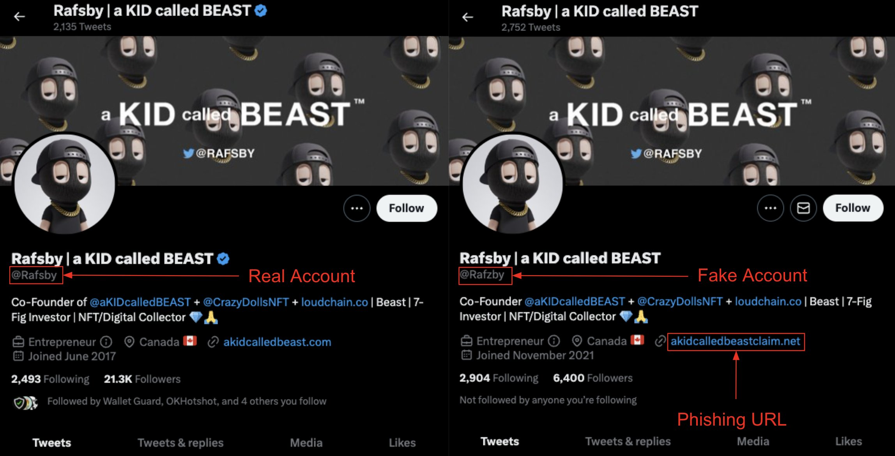
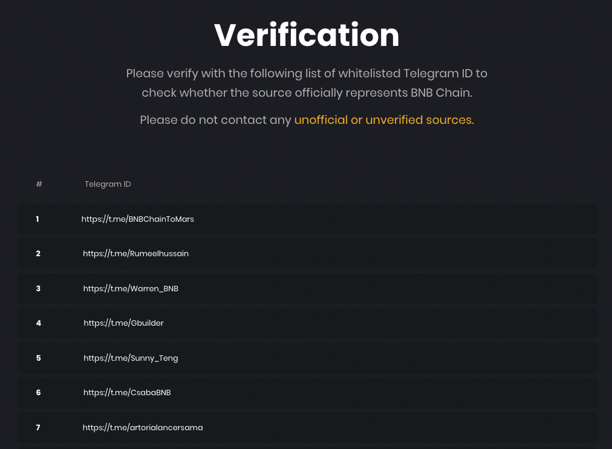
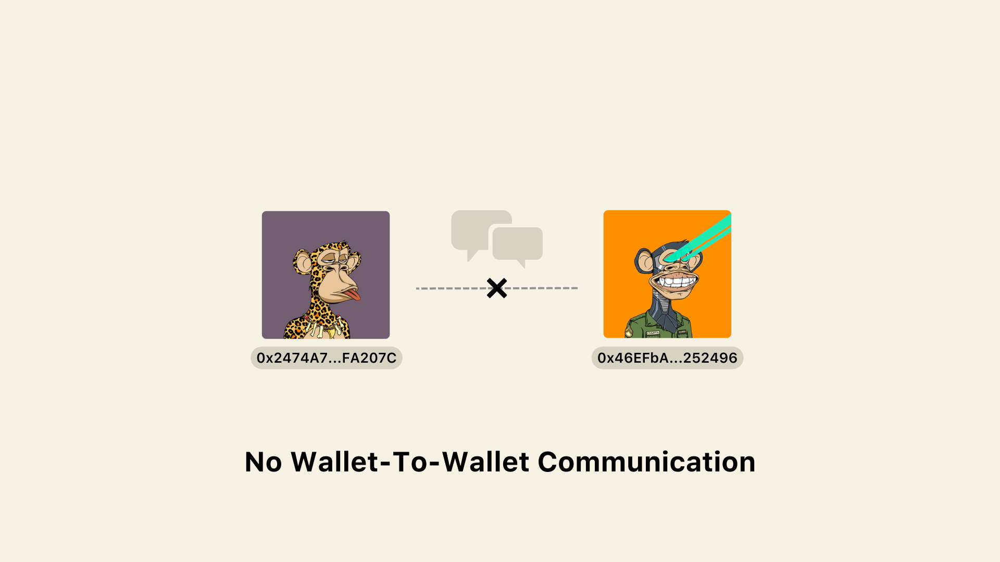
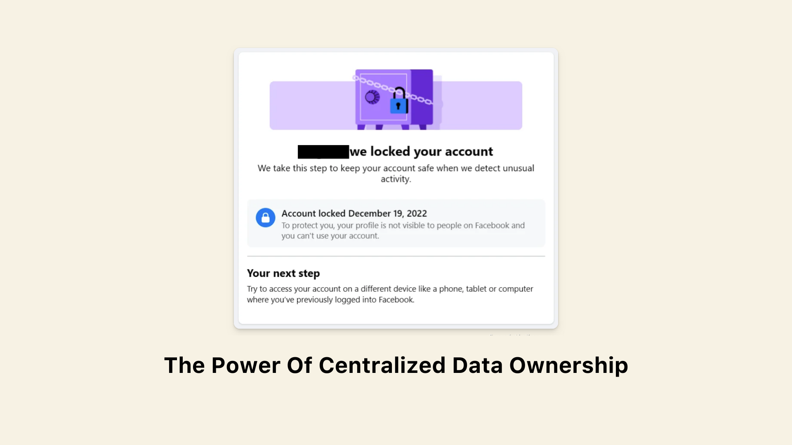
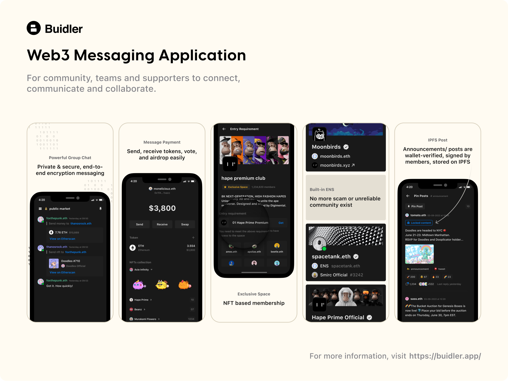

import { Tweet } from "react-twitter-widgets";

export const EmbedTweet = () => <Tweet tweetId='1533187460074815489'/>

Web3 is forging a new path, radical shifting from the centralized model to shared ownership and decentralized decision-making. And when the web3 community continues to evolve and mature, one thing becomes clear: Discord and Telegram just don't fit in anymore.

It's essential to consider the limitations of traditional communication platforms and explore new, more suitable options for this new era.

In this post, we deep dive into the problems these platforms face and explore the exciting possibilities of a new era beyond Discord and Telegram.

## 1. The Impersonation Epidemic

This lack of verification opens up the opportunity for phishing and other types of scams.

**[Gordon Goner](https://twitter.com/gordongoner)**, the mastermind behind [YugaLabs](https://twitter.com/yugalabs) and [Bored Ape Yacht Club (BAYC)](https://twitter.com/boredapeyc), has admitted that Discord servers in the crypto world are too vulnerable to cyberattacks.
<EmbedTweet />

Hackers have been stealing millions in NFTs by hacking chatbots used by official Discord servers and spreading phishing links. Well-known NFT projects such as [BAYC](https://mobile.twitter.com/BoredApeYC/status/1533181013815349248), [KnownOrigin](https://twitter.com/KnownOrigin_io/status/1536552532738285568), [Bubbleworld](https://coinquora.com/hackers-breach-4-discord-nft-servers-following-bayc-server-hack/), [Parallel](https://luckytrader.com/nft/parallelalpha/news/parallel-discord-hacked-this-morning-control-restored), [Lacoste](https://nftevening.com/lacoste-discord-is-the-latest-to-be-hacked/), [Tasties](https://crypto.news/tasties-nft-discord-hacks-mess/), [Anata](https://web3isgoinggreat.com/single/lacoste-discord-among-the-latest-to-be-hacked), and many others were among those that fell victim to these hacks.

Hackers compromise NFT Discord servers via phishing, social engineering, and bots. Webhooks, a popular feature in web apps including Discord, has become the target for NFT thieves. Vulnerabilities in plugins like Dyno, MEE6, and CollabLand leave vulnerable to hacker takeovers as administrators, with the ability to send messages and DM users.

<!-- [https://twitter.com/mee6bot/status/1526901242521432065?lang=en](https://twitter.com/mee6bot/status/1526901242521432065?lang=en) -->

<blockquote class="twitter-tweet">
Some servers have reported MEE6 being used to post unwanted messages. There is no technical breach in our systems. This was due to one of our employee&#39;s account getting compromised.  ✅ The issue is now fixed and we&#39;ve taken all the steps to make sure it never happens again.
&mdash; MEE6 (@mee6bot) <a href="https://twitter.com/mee6bot/status/1526901242521432065?ref_src=twsrc%5Etfw">May 18, 2022</a></blockquote>

After compromising the servers, scammers trick users into connecting their wallets to malicious sites. They create a sense of urgency with NFT giveaways and “exclusive” minting events, prompting users to act quickly to avoid missing out on a free giveaway or limited inventory.

Below is an example of how they do it:

<!--  ](Discord%20in%20Web3%20From%20Crypto%20Haven%20to%20Scam%20Hub%207bfb144f56184ac4af15a3f42ac10952/Untitled.png) -->
Source: [OKHotshot](https://twitter.com/NFTherder)

The distinction between fake and real accounts is made difficult by relying solely on username and avatar. This has resulted in numerous fake scams within the crypto and web3 communities.

<blockquote class="twitter-tweet">
I have not asked anyone for anything. DO NOT send anything to anyone using my name and account number! The discord you see below is a fake account. A couple other CryptoPunks owners have scammers acting as them as well. <a href="https://t.co/9YWcTLYAJd">pic.twitter.com/9YWcTLYAJd</a>
&mdash; CryptoNovo (@CryptoNovo311) <a href="https://twitter.com/CryptoNovo311/status/1610635662709100545?ref_src=twsrc%5Etfw">January 4, 2023</a></blockquote>

Not only Discord, but also many impersonations happen on platforms like Twitter, Telegram every day.

<!--  -->

Distinguishing between fake and real accounts is a challenging task.

Both Changpeng Zhao (CEO of Binance) and Vitalik (co-founder of Ethereum) must also issue warnings about impersonation on web2 socials.

<blockquote class="twitter-tweet">
LinkedIn has 7000 profiles of &quot;Binance employees&quot;, of which only 50 or so are real. I wished LinkedIn has a feature to let the company verify people. So, many &quot;hey I am responsible for listing&quot; scammers on LinkedIn. Be careful. <a href="https://t.co/Qnsl02iQUT">https://t.co/Qnsl02iQUT</a>
&mdash; CZ 🔶 Binance (@cz_binance) <a href="https://twitter.com/cz_binance/status/1558894008893669378?ref_src=twsrc%5Etfw">August 14, 2022</a></blockquote>

Binance is doing what they can to combat impersonation scams on Telegram with a temporary solution. It takes time to verify. And it's not widely known.

<!-- ](Discord%20in%20Web3%20From%20Crypto%20Haven%20to%20Scam%20Hub%207bfb144f56184ac4af15a3f42ac10952/Screen_Shot_2023-02-05_at_21.08.28.png) -->

Source: [BNB Team Verification](https://www.bnbchain.org/en/verification)

## 2. The Communication Gap

<!--  -->

The missing piece in web3 community building is a way for people to communicate directly with each other using their wallets.

With the rise of decentralized finance (DeFi) and non-fungible tokens (NFTs), there is a growing need for better communication that can bring together NFT owners, project creators, and other stakeholders. 

To understand, let's consider the following examples:

1. NFT Acquisition: Imagine you come across an NFT that you want, but it's not for sale. With a wallet-to-wallet communication tool, you could directly reach out to the NFT owner to ask if they are willing to sell and make an offer.
2. Defi Liquidity Alert: DeFi lending protocols need a way to let liquidity providers know when they're in danger of liquidation. A wallet-to-wallet communication tool could send push notifications to alert providers, allowing them to take action and avoid unexpected losses.
3. DAO Governance: During a contentious governance vote, direct communication could be the deciding factor. A wallet-to-wallet communication tool could enable DAO members to reach out and persuade token holders to vote in a particular direction.
4. Community Building: For new NFT projects aiming to grow their community and attract early users, direct communication with potential users could be a powerful tool. Rather than relying on traditional methods, such as Medium posts and Discord servers, a wallet-to-wallet communication tool would enable projects to directly reach out to user addresses and incentivize them to contribute.

Such a tool is necessary for the full potential of tokenization and decentralization in community building.

## 3. Who Really Controls Your Data

<!--  -->

Facebook, Twitter, Discord, and Telegram are centralized, making it a potential risk to your online reputation. Any policy changes or errors could quickly undo all the effort and community-building you've made over the years.

I have experienced this harsh reality firsthand on Facebook. Despite spending years building a solid presence and forming valuable relationships, a hacker's false report caused Facebook to suspend my account, instantly wiping away my reputation and connections. 

And now I have to rebuild my reputation on Facebook from scratch.

Social media giants do not prioritize content creators and community builders. Their algorithms prioritize user engagement overreaching the intended audience, and have no qualms about exploiting your data for profit.

Technical issues & cyber-attacks endanger privacy & security. Recent scandals involve misuse of user data, e.g., privacy violations, breaches, etc.

1. [Cambridge Analytica Scandal](https://en.wikipedia.org/wiki/Facebook%E2%80%93Cambridge_Analytica_data_scandal): In 2018, the Cambridge Analytica Scandal exposed how a political consulting firm obtained data on millions of Facebook users without their permission and used it to manipulate the 2016 US Presidential Election
2. [Twitter Account Suspensions](https://en.wikipedia.org/wiki/Twitter_suspensions): In 2021, Twitter's suspension of many accounts for violating its terms of service sparked doubts about the security, ownership, and control of user data on the platform.

The power should be in your hands. Don't let centralization harm your hard-earned efforts and relationships.

## 4. No Tokenization Support

Discord and Telegram may seem like the perfect solution for connecting with others, but they're not the ideal platform for those who want to build a thriving Web3 community.

Let's start by discussing token gating. As a community manager, you must incentivize and reward members for their contributions and involvement. Token gating is a powerful tool for community owners, providing exclusive access and benefits to those who hold specific tokens/NFTs.

However, without built-in support for token gating, Web3 users have had to use 3rd-party tools like [CollabLand](https://www.collab.land/) or [Guild.xyz](https://guild.xyz/) for token gating access to their communities.

What about Decentralized Autonomous Organizations (DAOs)? To create and manage organizations governed by members, Discord users must rely on separate tools, such as [Snapshot](https://snapshot.org/), [Tally](https://tally.xyz/), [Gnosis Safe](https://gnosis-safe.io/), or [Juicebox](https://juicebox.money/), for voting on proposals, allocating funds, and making decisions.

And let's remember relying on multiple third-party tools increases the threat to your community's privacy and security. So what's the solution?

## A Native Platform: The Key To Building A Thriving  Web3 Community

The solution is simple. It's time for Web3 communities to have a native platform that supports their needs and values. A platform that puts the power back in the hands of community members, enabling them to create, grow, and manage their communities without sacrificing privacy, security, and control.

### Introducing Buidler

<!--  -->

Buidler is a web3 native messaging platform that provides users with a secure, efficient, and user-friendly means of communication and collaboration. Whether you're looking to build stronger relationships with your audience, or simply want a secure and decentralized means of communication, Buidler is the perfect solution for you.

With Discord's current problems, Buidler has got you covered:

### Impersonation

As a web3 platform, your digital identity is tied to your blockchain wallet, where online identity is  decentralized, and under your control.

Buidler solves the impersonation problem with its combination of ENS and NFT Avatar. ENS ensures that each address has a unique and verified name, while NFT Avatars add a visual identity, making it easier to recognize and interact with one another.

### Communication

You'll experience wallet-to-wallet communication that's private, secure, and designed with end-to-end encryption by default.

Imagine directly connecting with your token holders, supporters, or community members—no more guesswork or confusion about who's who. With Buidler, you can communicate directly and effectively, creating stronger relationships with your audience.

With Buidler, you get the best of both worlds: the convenience of modern messaging and the security of decentralized technologies.

### Data Ownership

In the web3 world, ownership and control over your data is a top priority. And this idea is being realized in Buidler.

IPFS storage enables users to store their official announcements and posts in a decentralized way. Allows users to access their data from anywhere, making it much more convenient and reliable.

With decentralized identity solutions like ENS and NFT Avatars, web3 users can create an online identity that is unique, secure, and truly theirs.

Ready to take control of your data?

### Token-based Activity

Our platform is built specifically for the Web3 world, so we understand the unique needs of your community. Whether it's creating and managing organizations governed by members, creating and managing voting mechanisms, or facilitating token-based activities like voting, token gating, and allocating funds, Buidler makes it easy and seamless.

Buidler provides the tools and infrastructure necessary for building and managing token-based communities, without the need for third-party intermediaries.

## Final Thoughts

> “Ultimately, the goal of crypto is not to play games with million-dollar pictures of monkeys, it’s to do things that accomplish meaningful effects in the real world.” - [Vitalik Buterin (co-founder of Ethererum)](https://decrypt.co/95683/ethereum-vitalik-buterin-dont-hate-bored-ape-nfts)
> 

And that's just what Buidler is all about!

Our goal is to bring the power of Web3 to everyone, making it easier for anyone to participate in and benefit from this exciting new ecosystem. Whether you're a developer, a community organizer, or just someone looking to take control of your digital assets, Buidler has you covered.

So why wait? Head to our website to learn more and download our app today. Together, let's make Web3 happen!

- Download for iOS: [https://buidler.app/download/ios](https://buidler.app/download/ios/)
- Download for macOS: [https://buidler.app/download/mac](https://buidler.app/download/mac/)
- Try in your browser: [https://community.buidler.app](https://community.buidler.app/)
- Learn more about us: [https://buidler.app](https://buidler.app/)
- Follow us on Twitter: https://twitter.com/buidler_app
- Join our community: [https://invite.buidler.app/buidler](https://invite.buidler.app/buidler)