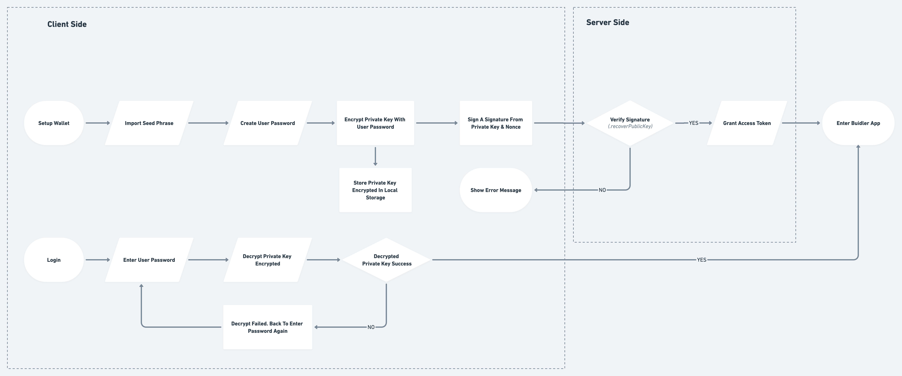

<head>
  <meta
    property="og:image"
    content="https://docs.buidler.app/img/blog/how-buidler-store-your-password.png"
  />
</head>

# How Buidler Stored Your Password

Builder is a perfectly combining social messaging and crypto wallet. In addition to messaging, you can easily store, transfer and receive tokens and NFTs.

To accomplish the mission is bringing Web3 to life. Protecting your privacy and assets is our highest priority in every decision. And the security will begin with your password, a gatekeeper to protect you, your wallet, and your crypto assets from loss or theft.

Let's learn about what it does and why it's critical.

## Your password - the key to your vault

Unlike the account password, you usually use on Messenger, Telegram, or Discord. When you enter the username and password in the login form, the app checks that these details match the hashed information stored on its server. In that case, they use your password to verify your identity.

Builder password is a different thing. We use the user password to encrypt and decrypt the seed phrase.

**Why do we need to encrypt the seed phrase?**

Until now, most people don’t know what a seed phrase is or what will happen if they lose it. The seed phrase (also called “mnemonic phrase” or “secret recovery phrase”) is a unique 12-word phrase generated when you create a new wallet.

This phrase allows you to sign transactions to transfer tokens or NFTs and recover your wallet if your device is lost. That means whoever knows your seed phrase can reconstruct your crypto wallet and take all assets out of your wallet.

That's why we need to guard your seed phrase with multiple layers of defense heavily. The encryption layer is one of those defenses.

## How **do** we encrypt your seed phrase?

Builder uses AES-256 encryption [1] to turn your private key into encrypted data that no one can read, not even if hackers stole your data.

AES (Advanced Encryption Standard) is also known for applying in many well-known security software and password management applications that you are probably already familiar with, such as LastPass or 1Password [2]. And now, it is widely accepted as the strongest encryption and is used by governments, militaries, banks, and other organizations worldwide to protect sensitive data.

The password is a vital component in Builder's encryption process. So, we ask you to choose a password as soon as you set up your wallet.

**Can AES-256 be cracked?**

In theory, It's possible to recover an AES encryption. But, a Microsoft research paper published in 2011 [3] suggested that cracking the AES-128-bit key would take billions of years with current computing power — and require the storage of some 38 trillion terabytes of data.

And to break or hack a symmetric 256-bit key (the encryption technique that Buidler is using) would require 2128 times the computing power of a 128-bit key. **That means it would take a device 3×1051 years to use up the 256-bit key capacity.**

Therefore, as of today, no supercomputer has been able to crack AES-256. So, you feel free to import your wallet to Buidler with peace of mind.

## How do we store your password?

When you create a password in the setup steps, your password will become the key to decrypting the encrypted data on the device.

Each time you enter the password, we use it to decrypt the encrypted private key. Your key is stored securely and only used when you need to make transactions on the blockchain.

When will decrypted data be cleaned from memory? When you kill the Builder app, the iOS System will clean it up. And when you log out of your account, we will clear all your encrypted data.

In short, encrypting and decrypting data in Builder requires something that ONLY you know – your password. We don't store your password and seed phrase anywhere on our servers and never transmit it over the internet.

The diagram below shows how we store your password and use it each time you enter it.

## Prevent strangers or hackers from guessing your password

Perhaps you will be worried if someone tries to guess or hackers use brute force attack techniques to hack your password and grant access to your wallet.

We designed the Self-Destructing Data mechanism. Your encrypted data automatically erases immediately after entering the wrong password 10-times.

We have a timer that will appear after a few failed attempts to prevent some accidental situations, such as your children playing with your phone:

- After the 5th failed attempt, we require a 1-minute timeout before you can try again
- After the 6th failed attempt: a 5-minute wait
- After the 7th failed attempt: a 15-minute wait
- After the 8th failed attempt: a 30-minute wait
- After the 9th failed attempt: 1-hour wait
- After the 10th failed attempt: erases your encrypted data automatically

This handy security feature gives you more peace of mind if your devices are lost or stolen. Carefulness is never excessive in a high-risk financial environment. Let us help you do that.

## What happens if you lose your password?

With fully cryptographic protection, you can't access your account without your password.

As we mentioned, your password is not stored anywhere. So no one can help you reset your password, including the Builder team. But don't panic!

You can set up a new password with your seed phrase by re-importing your wallet.

So, remember to keep your seed phrase in a safe and reliable place where you always have access. The seed phrase is non-recoverable, so you must say goodbye to all the tokens and NFTs you hold forever if you forget it.

**References**:

[1]: [The Advanced Encryption Standard](https://en.wikipedia.org/wiki/Advanced_Encryption_Standard) from Wikipedia

[2]: More details about [1Password](https://support.1password.com/1password-security/) and [LastPass](https://www.lastpass.com/security/zero-knowledge-security) use AES-256 Encryption, source from 1Password and LastPass website official.

[3]: [Microsoft research paper published in 2011](https://eprint.iacr.org/2011/449.pdf)
