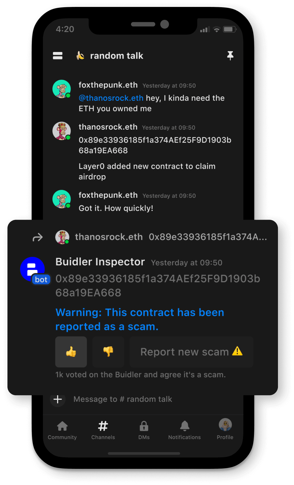

All communities on Buidler use decentralized voting to determine the acceptance of various entities, such as ENS, addresses, domains, dApps, smart contracts, tokens, and more. The outcomes of these votes are stored in decentralized storage and distributed across all communities to ensure everything is clear and fair when making decisions.

## What problems do we solve?

### **1./ Social media scams are all too common**

Scammers often use social media platforms such as Instagram, Facebook, WhatsApp, Discord, Twitter, and Telegram to target new cryptocurrency users.

Buidler is a web3 platform that strongly supports the principle of censorship resistance. As such, we fight against scams in a unique way by not censoring or controlling user-created content. Instead, it relies on the collective efforts of its users to keep the platform safe for everyone

To protect its users from such scams, Buidler has developed a system that flags and alerts users of harmful content that may be present on its platform, such as URLs, addresses, smart contracts, or tokens. The system is constantly updated by the collective power of all communities, ensuring that it can detect any new threats.

### **2./  Information is limited within each community**

Web3 communities are still operating independently and lacking in connection. Most communities are built around a project or a famous individual, so sharing knowledge and information is still limited and not synchronized.

For example, each community has its own **"#scam-report"** channel, but there is no central database for evaluating addresses, profiles, and scam teams. Imagine when a scammer is reported in one community. They can move to another community and continue their fraudulent activities.

This lack of coordination and information sharing can lead to slower detection and inaccurate reporting, which can make the problem even worse.

## Usecase

### 1./ Buidler Inspector

As part of this vision, Buidler Inspector is an assistant in all communities, helping identify URLs, address scams in messages, and warn all community members.

- **Protect immediately:** warn people immediately to avoid clicking on any links related to scams.
- **The data source is always fresh:** the data will be continuously provided by members of the community, ensuring that it is always up-to-date.
- **Community-driven, open source:** data collected is public for everyone, and contributions to report cases of fraud are incentivized.

