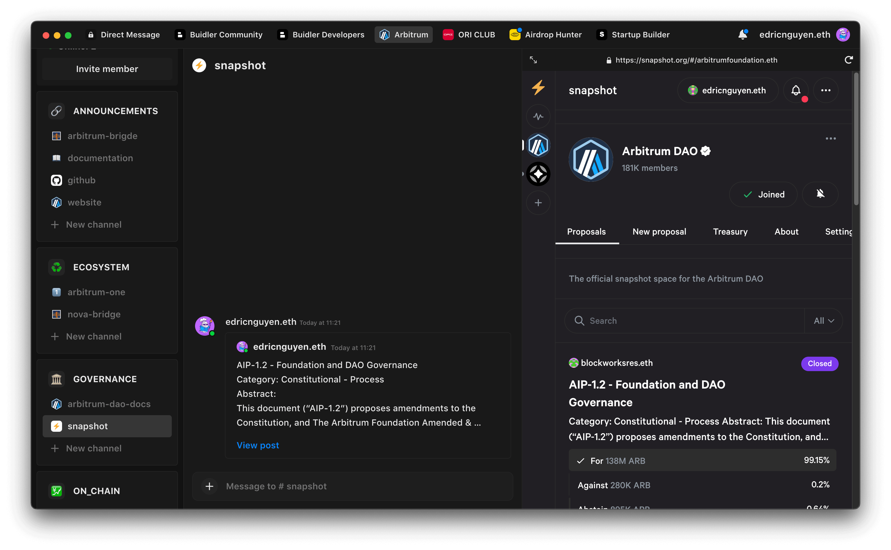
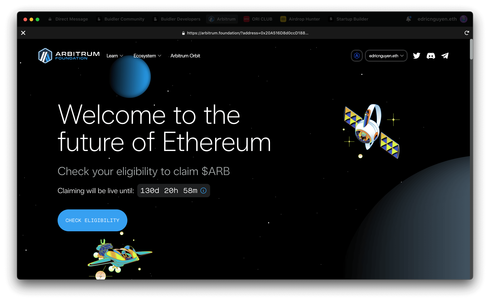
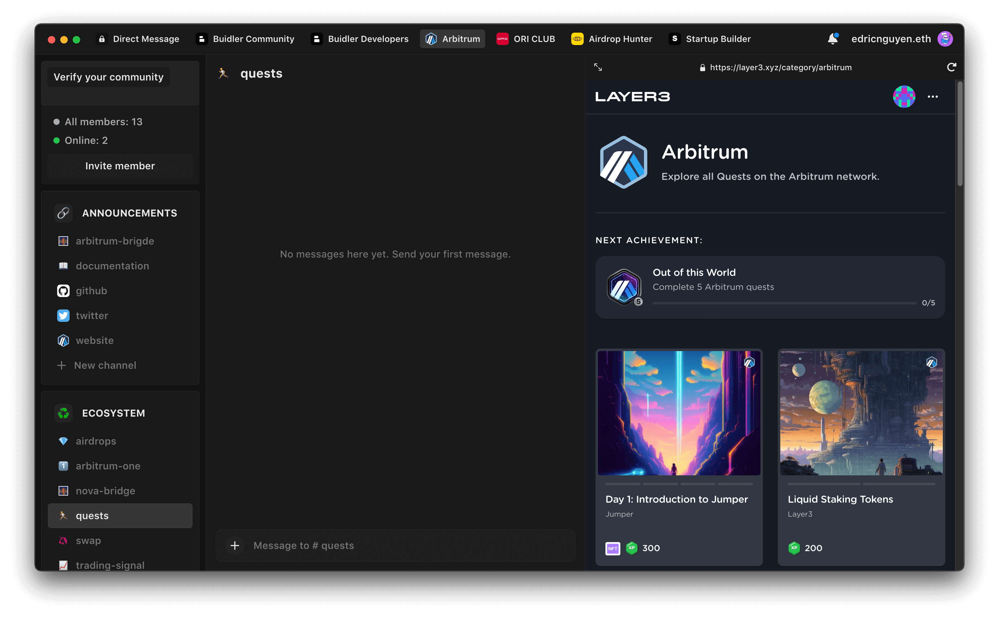
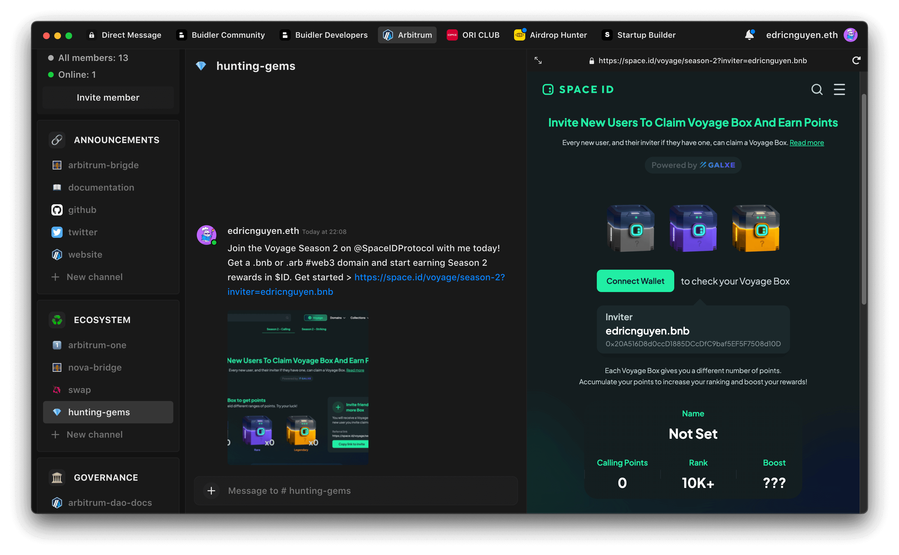

# DApp Browser

Buidler DApp Browser is a more efficient and secure way for your members to explore decentralized applications without ever leaving your community.

With each browser located directly in the chat channel, you can easily organize trusted websites, social accounts, and DApps. That way, your members can effortlessly access and interact with the legit links without worrying about clicking on suspicious links.

## Use Case

The DApps browser has many applications for different communities. Below I will give an example of a recently popular project community, Arbitrum. With Buidler, you can multitask while you chat, such as:

- View official websites, Twitter, and important links
    
    
- Swap and buy $ARB token on Uniswap
    
    
    
- Vote for DAO governance on Snapshot instantly
    
    
    
- Claim airdrops from the official website of Arbitrum Foundation
    
    
    
- Join missions on Layer3, Galxe, and Crew3...
    
    
    
- Hunting airdrop and earning through referral links.
    
    
    
- Trade on the DEX exchanges
    
    
    
- Buy and sell NFT on marketplaces
    
    
    

Make your community become a centralized hub for members. Buidler's got your back with all the support you need.

## How to create a DApp Browser channel?

Let me show you how to set up a DApp browser right inside our chat channel.

Go to **→ Add new channel →  Turn on “DApp Support” → Enter the DApp link → Click “Create Channel”**. That's a piece of cake, isn't it?

## How to update a DApp Browser channel?

If you want to change the URL of a link in the DApp Browser. Here are the steps:

Head over to **→ Channel Setting → Edit DApp Url → Save**. You're all done!

