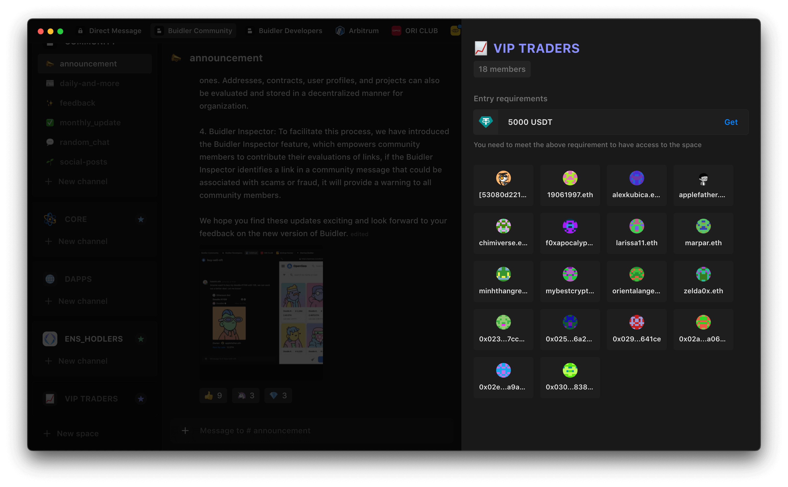

# Exclusive Space
An exclusive space is a private area that provides token owners with exclusive content, special perks, and benefits. By requiring ownership of a specific token, you can ensure that only like-minded and invested individuals are granted access to exclusive content. This fosters a sense of privacy and collaboration in your community.

With Buidler, you can enjoy seamless access by your own NFTs or tokens without suspicious bots and complicated verification steps.

## Why do we need a exclusive space?

Exclusive space helps to create a dedicated and passionate group of individuals who are committed to your vision and can contribute to the success of your project. In addition, exclusive spaces provide a sense of privacy and security for members freely to share ideas, provide feedback, and gain insights from one another.

To build a stronger community, you need to surround yourself with elite members. And exclusive space is the way to do it.

## Usecase
Exclusive space, also known as token-gating, operates by creating private rooms and requiring members to hold specific assets in their wallets to join. This simple method can be adapted to meet a wide variety of needs, depending on how your community operates. 

Here are two easy-to-use applications to consider:

### Make your trading group exclusive.

Exclusive space is an effective way to filter all the low-quality, scamming losers in the crypto-trading community.

In addition, you can segment your members into different groups based on the number of tokens they hold. This approach can help your better understand your members and assist them to allocate their investment portfolio more efficiently based on their capital.

### Automatically identify your token holders.

After releasing your tokens or selling NFTs on trading platforms, it's crucial to gather a community of interested individuals who provide valuable feedback to continue developing your project.

By creating an exclusive space, you can serve as a hub for your community to share updates, news, and upcoming releases. You can also offer exclusive benefits, such as early access to new releases or special discounts, which can help foster loyalty and keep your supporters engaged.

