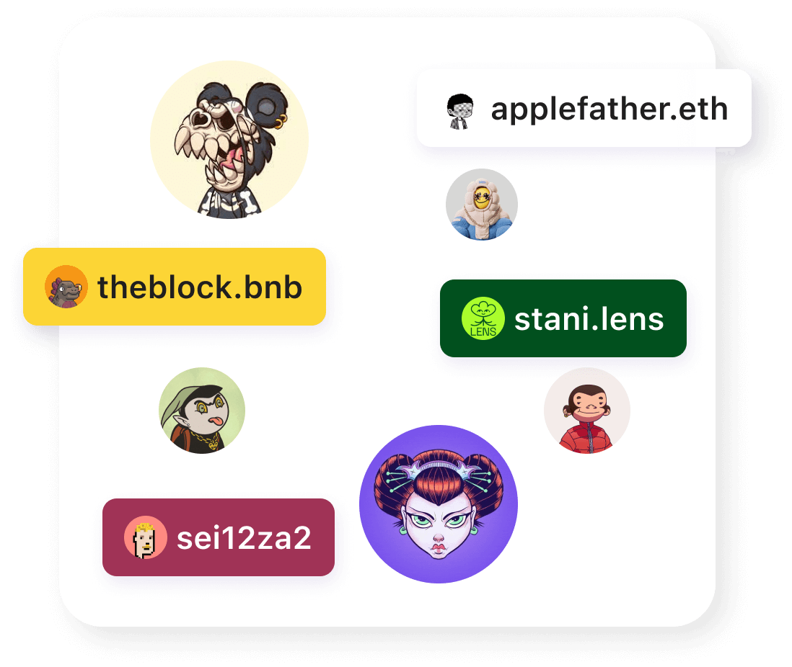

Buidler provides a platform for users from different blockchains to communicate and exchange assets with each other in the most convenient way possible. Users can seamlessly chat, explore, buy, sell, and exchange NFTs and tokens across multiple blockchains.

## Why multi-chain citizens?

Buidler's long-term vision is to provide a platform that allows for seamless communication and exchange of assets, regardless of which blockchain you are on.

Interoperability is becoming increasingly important in blockchain, and Buidler is well-positioned to address this need. By allowing tokens to move freely between different blockchains, Buidler enables the transfer of value and tokenized assets across different ecosystems.

Buidler eliminates the barriers between different blockchains to allow data and value to flow seamlessly. This ultimately helps to create an open and accessible platform that connects various communities from multiple networks in one place.