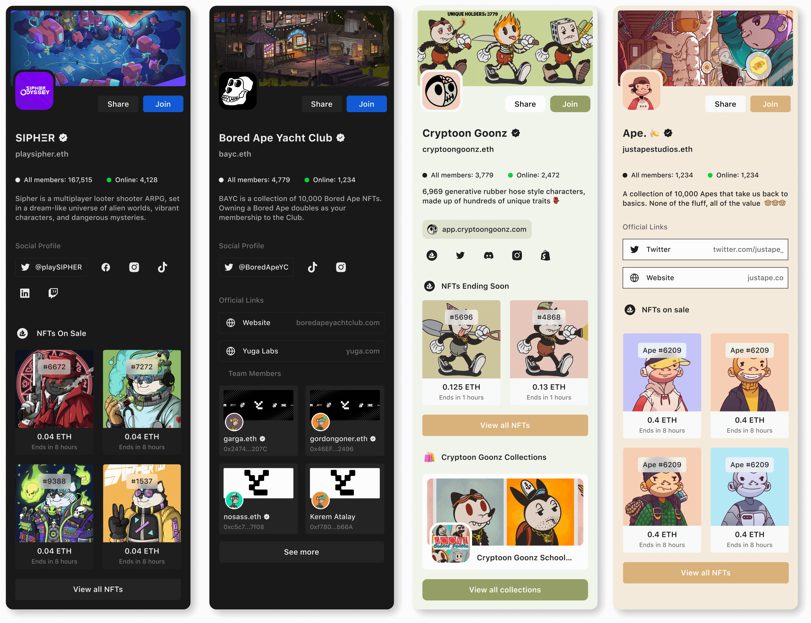

# Web3 Profile

Builder Profile is an all-in-one profile that lets you show your web2 and web3 presence in one place. This means you can put all your links to websites, social media accounts, smart contracts, NFT collections, and DApps under your web3 identity. This makes it easy and safe for your followers to find all your information and keep up with your latest news and announcements.

Build a trustless profile, simplify sharing and foster community growth.

## Why do we need the Buidler Web3 Profile?

Our profile page offers the perfect blend of the strength of Web2 and Web3 to help you share your trustless profile with everyone. There are several reasons why you should use our platform:

### 1. Make your audience feel and stay secure.

Having a large social media audience makes you a target for scammers who may impersonate you and trick your followers into visiting phishing websites to steal their assets.

In Buidler, your profile is identified by your wallet address. This means that when you post content, your wallet address is attached to it as a way of proving that it is authentic and belongs to you.

To keep your information secure, we ask for your wallet signature before making any changes to your profile. After that, the changes will be saved on IPFS, where everyone can see them. This way, your profile is verifiable and unalterable, ensuring your identity remains safe and secure.

### 2./ Simplify sharing with a single link.

Buidler makes it easy for builders and creators to keep all their online content from multiple platforms and chains in one place. 

It’s an all-in-one hub that brings together the best of Web2 and Web3. You can collect links to websites, blogs, social media accounts, tweets, and videos here. Moreover, you can share tokens, smart contracts, NFTs, and Soulbound tokens (SBTs) with your followers.

By creating a hub that is easy to navigate and provides a wealth of information, you can encourage your followers to engage with your project and become active members of your community.

### 3./ Brings DApps to thousands of audience

With our Web3 native platform, we allow you to customize and integrate various DApps such as Uniswap, Opensea, Snapshot, and more into your profile page. The audience can buy, sell, mint, swap, and do whatever they can to get more people involved in the project.

By making things easier for your users, you can give them a smoother experience that motivates them to get involved and participate more fully in your project, which can really increase your chances of success.

## Usecase

### 1./ Build your own homepage

A Web3 profile is used as a link-in-bio page that includes links to your social media accounts, websites, and other online profiles, making it easier for your audience to stay up-to-date and connect with you. The crypto assets you choose to invest in or purchase reflect your interests, values, and personality. Combining web2 and web3 profiles can give you a unique online presence.

### 2./ Build your community portal

By using Builder Profile, you can easily communicate with your followers and provide the information they need, as well as updates on the project's progress, upcoming events, and important announcements.

Additionally, you can customize your workspace with different themes, fonts, and colors, making the experience personalized and enjoyable for your followers.

Buidler Web3 Profile is essential for any team looking to build a strong and engaged community around their project.

