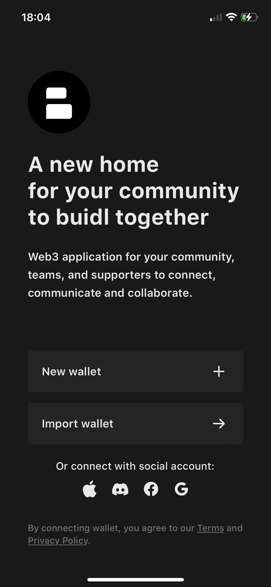
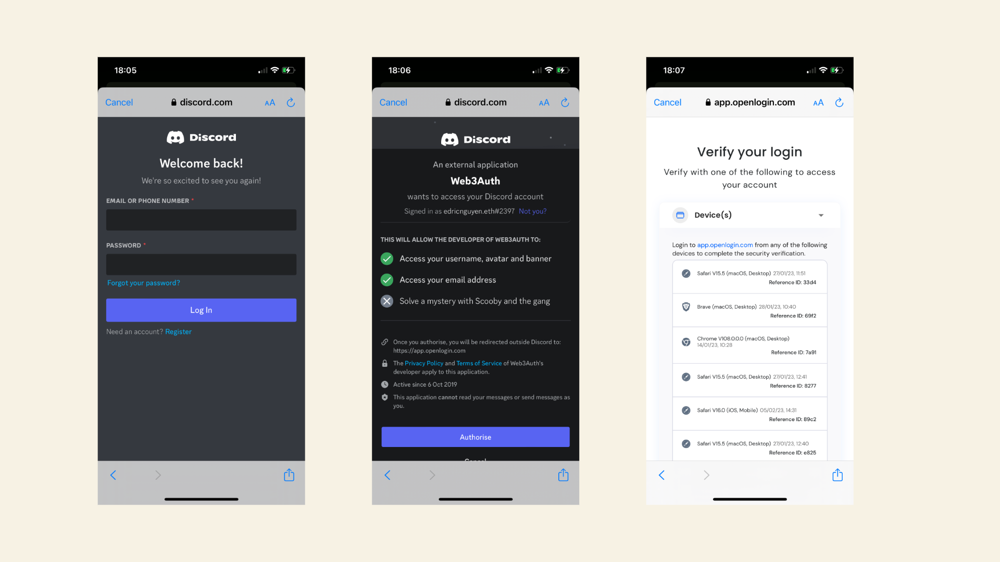
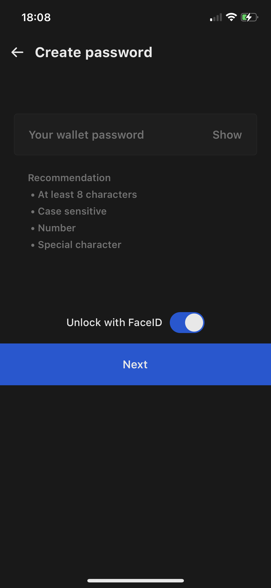
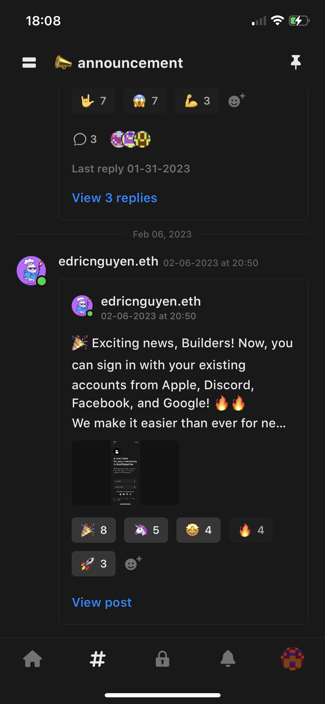

Getting started with Buidler is now easier with the integration of Web3Auth. You can now log in to your Buidler account using your existing social accounts like Google, Facebook, Apple, and Discord.
We currently support social login on both iOS and browsers. Here's how to get started on each platform:

### For iOS

**1. Open the Buidler app and select from Facebook, Apple, Discord, or Google.**

**2. Login your social account.** Follow the prompts to sign in with the social media platform of your choice.

    
**3. Create a password for login on Buidler.** Choose a strong and memorable password. This password will be used to encrypt and decrypt your seed phrase. Learn more about it in [this article](https://docs.buidler.app/docs/blog/how-buidler-store-your-password).    

**4. Congratulations,** your wallet will be imported and you are now a part of the Buidler community.

