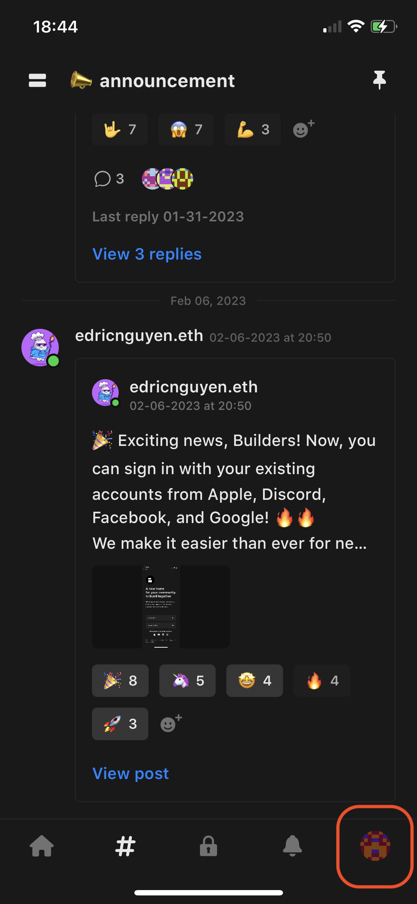
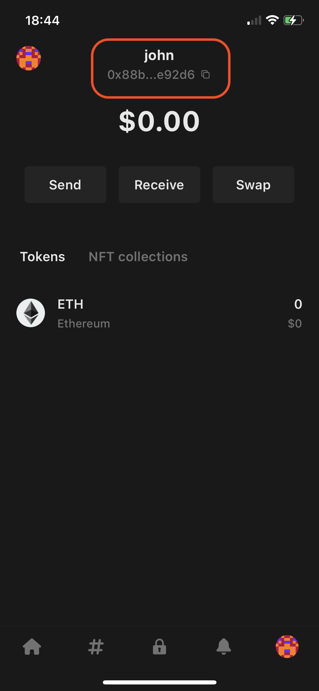
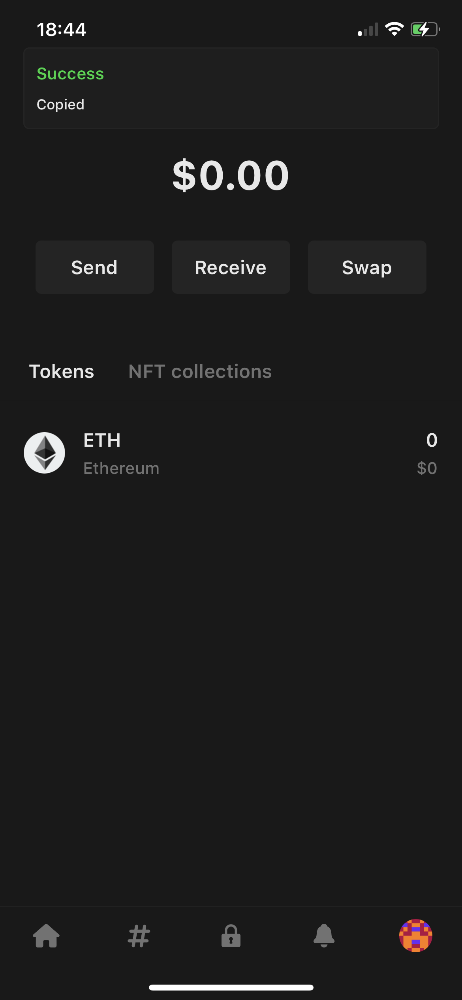
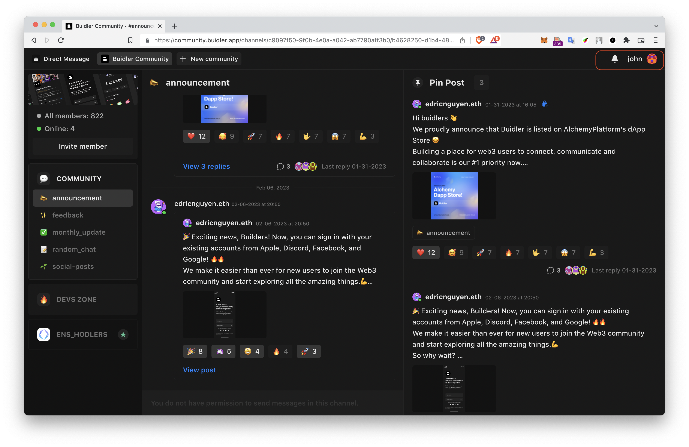
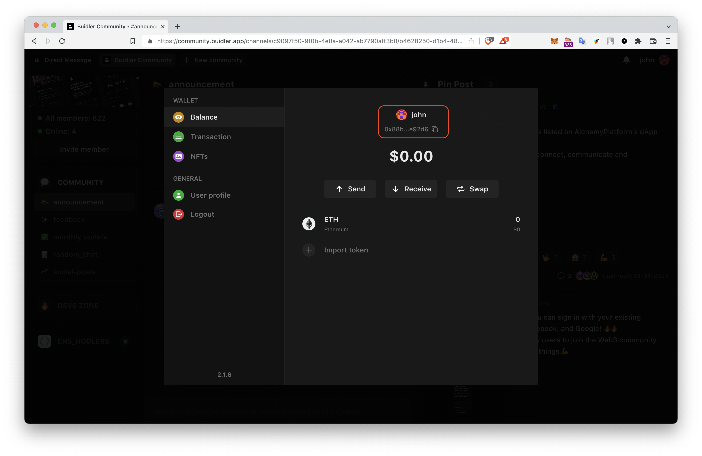
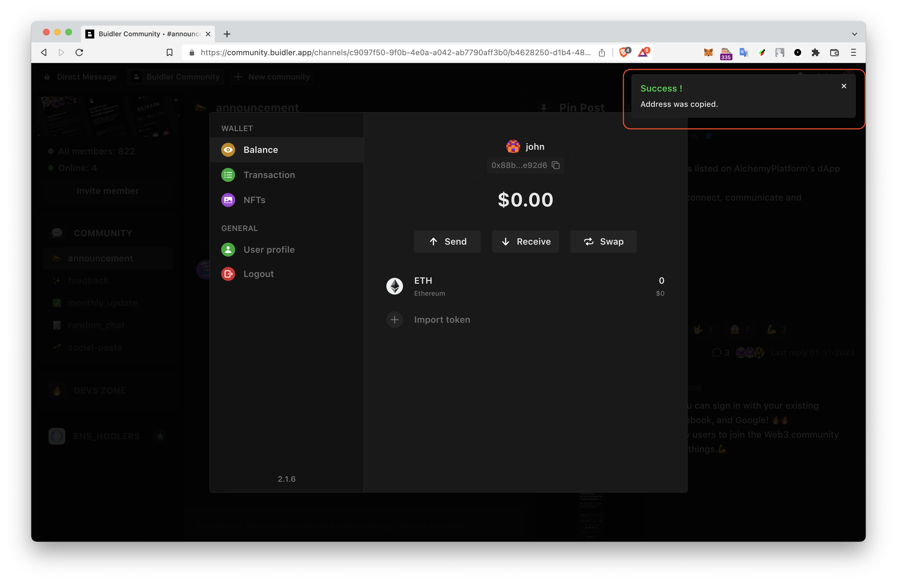

# Copy your wallet address

To copy your wallet address on Builder, you will need to follow a few simple steps:

### For iOS

**1. Open the Builder app and select the "Wallet" tab.**

**2. Copy your wallet address.**  See your wallet details, including your username and address. To copy your address, simply select on it below your username.

**3. "Address Copied"** popup message appears. Wallet address ready to be shared or used for blockchain transactions.

### For macOS and browser

1. **Open the Buidler app and click on your username located in the right corner.**

**2. Copy your wallet address.**  See your wallet details, including your username and address. To copy your address, simply select on it below your username.

**3. "Address Copied"** popup message appears. Wallet address ready to be shared or used for blockchain transactions.

