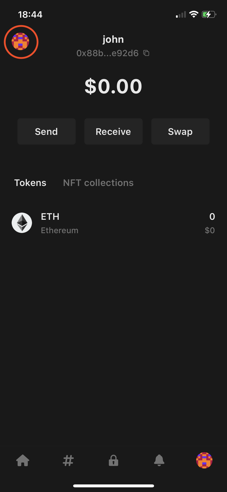
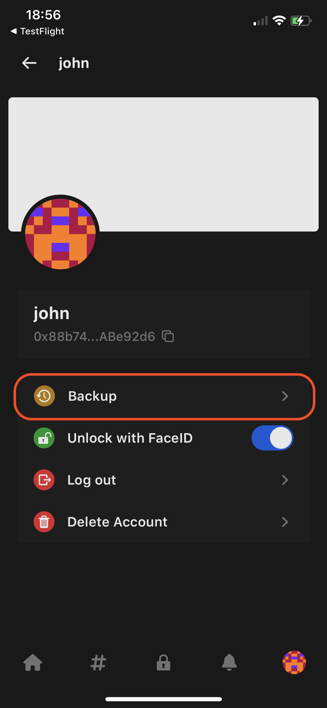
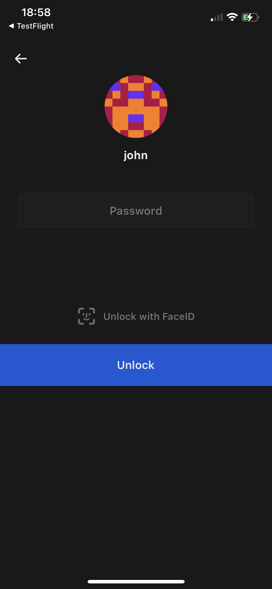
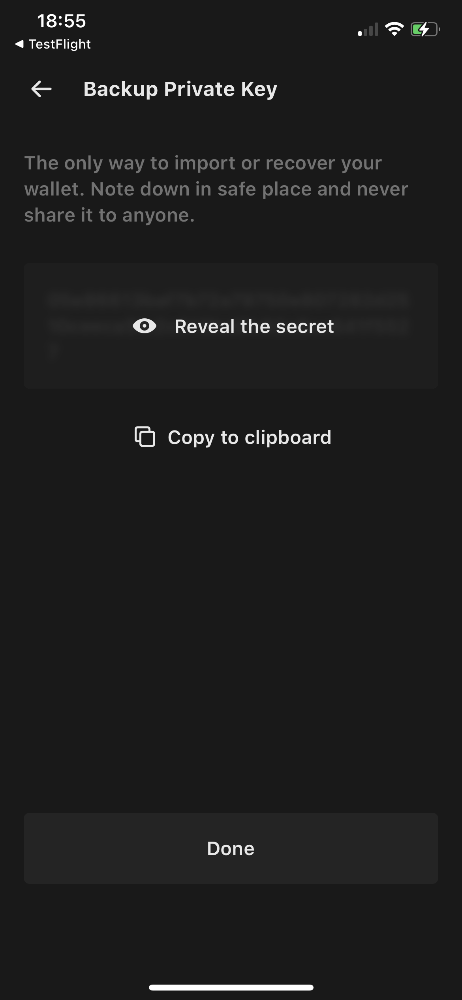

Backing up your private key and seed phrase is a critical step for securing your cryptocurrency assets. A private key is a unique, alphanumeric code that acts as a password for accessing your wallet. The seed phrase, also known as a mnemonic phrase, is a sequence of words that can be used to generate the private key.

If you lose access to your private key or forget your seed phrase, you won't be able to access the assets stored in your wallet. To avoid this, it's essential to back up your private key and seed phrase in a secure location, such as an offline physical document or a password-protected digital file.

To export and protect your private key or seedphrase on Builder, simply follow these steps:
### For iOS

**1. Open the Builder app and select the "Wallet" tab.**

**2. Open Settings.** To access your profile settings, select on your avatar in the top right corner.

**3. Next, select the "Backup" button to enter the Backup flow.**

**4. Verify your identity.** You'll need to verify your identity to access the private key and seed phrase. Use your password or Face ID.

**5. Backup your wallet.** After successful authentication, you will be taken to a screen displaying your private key or seedphrase. To view it, select "Reveal the secret". To copy it, select "Copy to clipboard".

Note: keep it in a secure location to ensure the safety of your funds.