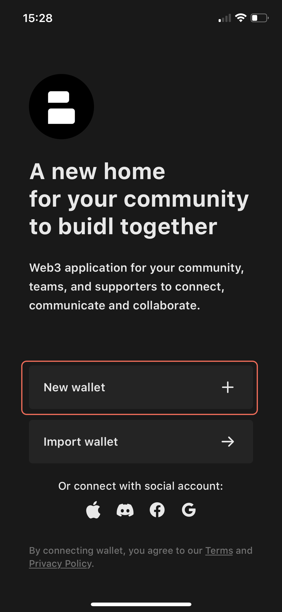
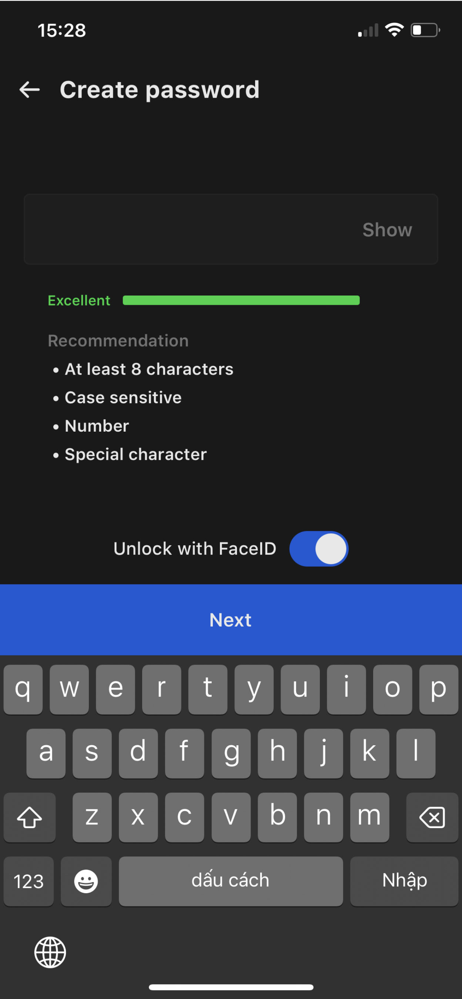
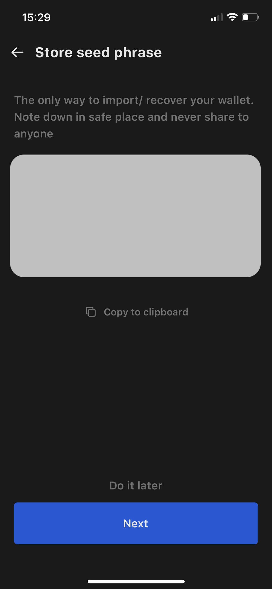
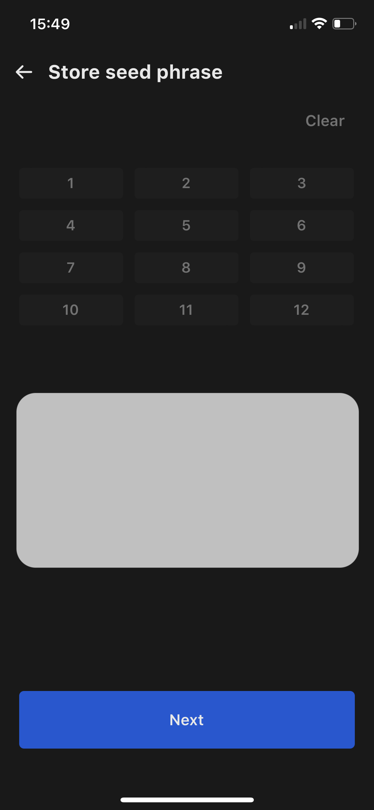
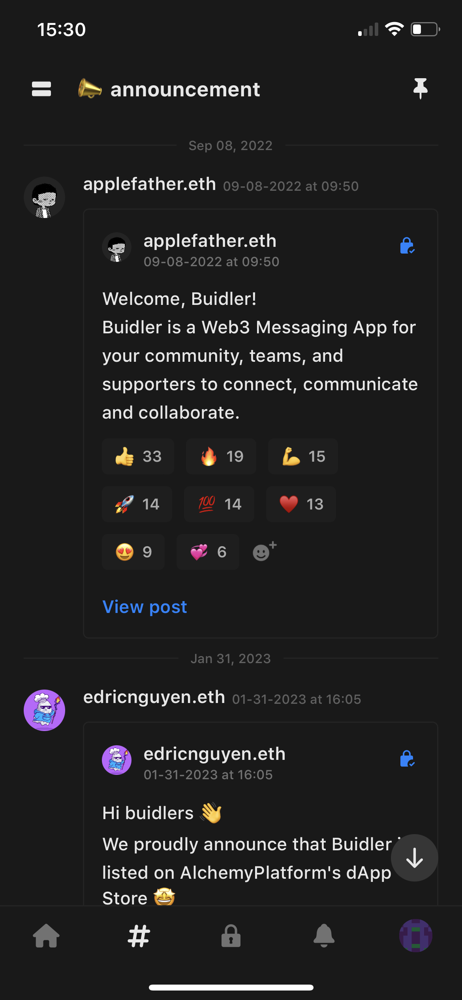
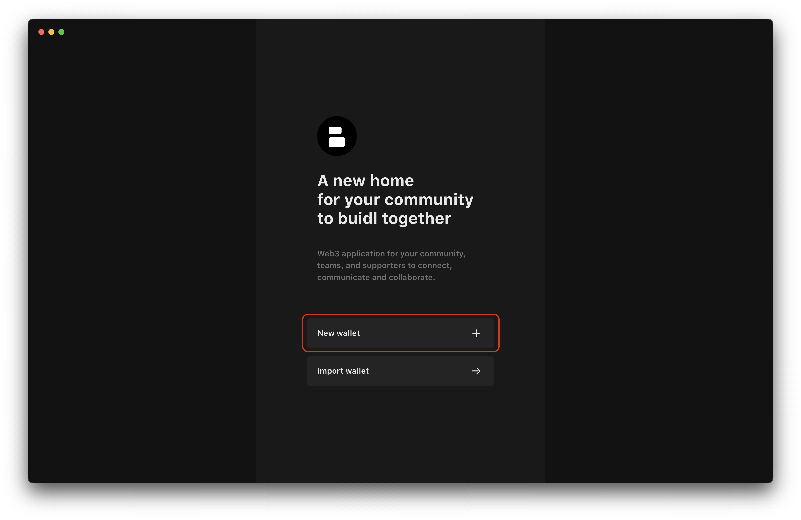
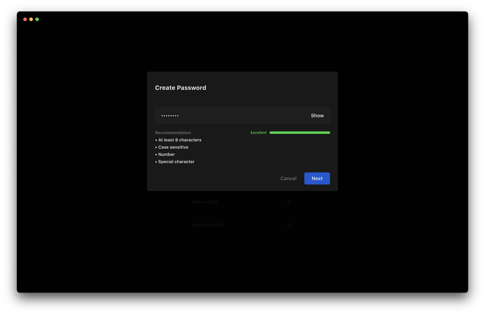
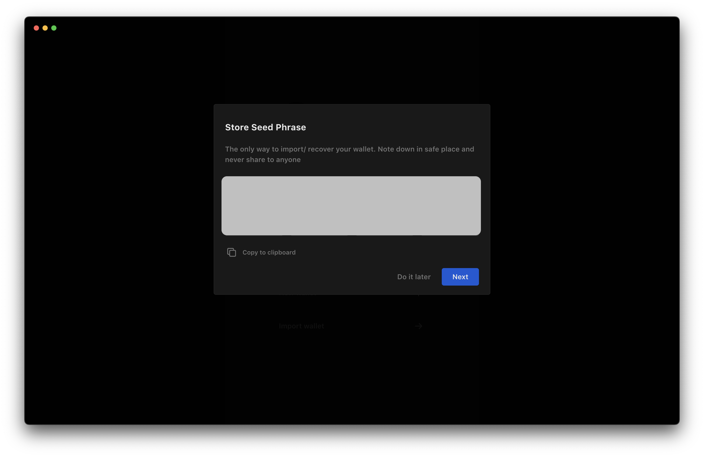
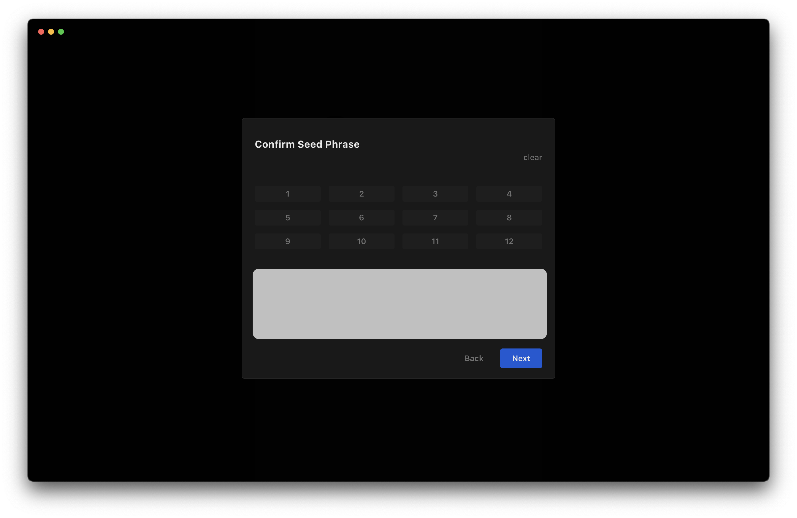
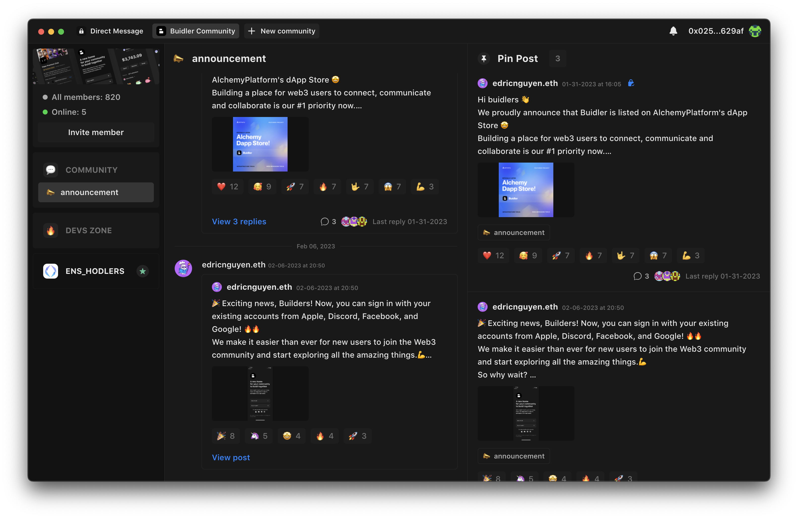

Buidler also provides a secure and easy-to-use crypto wallet that enables you to manage your digital assets with ease.

Download the Buidler app on your [iOS](https://buidler.app/download/ios) or [macOS](https://buidler.app/download/mac) device to get started.

To create a new wallet on Buidler, follow these steps for your platform:

### For iOS

1. Open the Buidler app and click on the "Create Wallet" button.

     

2. Set up a new password to login on Buidler. Make sure to choose a strong password that you can remember. This password will be used to encrypt and decrypt your seed phrase. Learn more about protecting your private keys with [this article](https://docs.buidler.app/docs/blog/how-buidler-store-your-password).

    

3. Once you've created your password, you'll be shown a 12-word seed phrase. This acts as your wallet's backup and recovery mechanism. Make sure to write it down on a piece of paper. Don't share it with anyone.

    
    

4. Confirm your seed phrase (optional)**.** Once you've saved your seed phrase, you'll be prompted to confirm it. Type the words in the correct order to make sure you've written down the seed phrase correctly.

    
    

5. Lastly, your wallet will be created and you will be taken to the main screen.
    
    
    

### For macOS

1. Open the Buidler app and click on the "Create Wallet" button.
    

2. Set up a new password to login on Buidler. Make sure to choose a strong password that you can remember. This password will be used to encrypt and decrypt your seed phrase. Learn more about protecting your private keys with [this article](https://docs.buidler.app/docs/blog/how-buidler-store-your-password).
    
    
3. Once you've created your password, you'll be shown a 12-word seed phrase. This acts as your wallet's backup and recovery mechanism. Make sure to write it down on a piece of paper. Don't share it with anyone

    
    

4. Confirm your seed phrase (optional)**.** Once you've saved your seed phrase, you'll be prompted to confirm it. Type the words in the correct order to make sure you've written down the seed phrase correctly.

    
    
5. Lastly, your wallet will be created and you will be taken to the main screen       
    
    

Buidler makes creating a wallet on iOS or macOS devices fast and simple. With Buidler as your crypto wallet, you gain full control over your funds and assets.