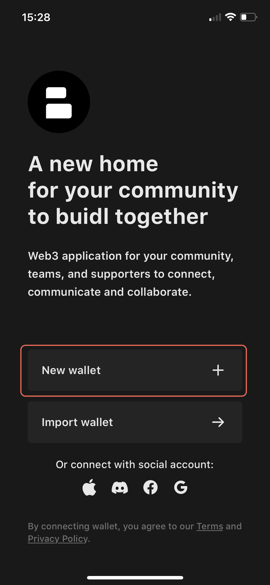
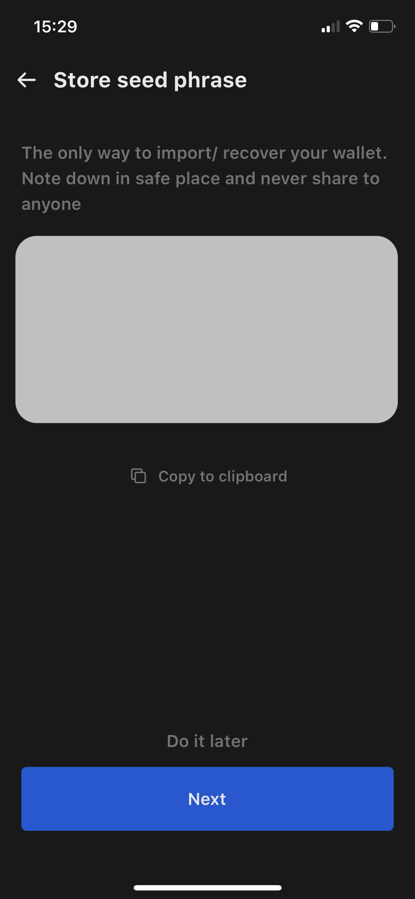
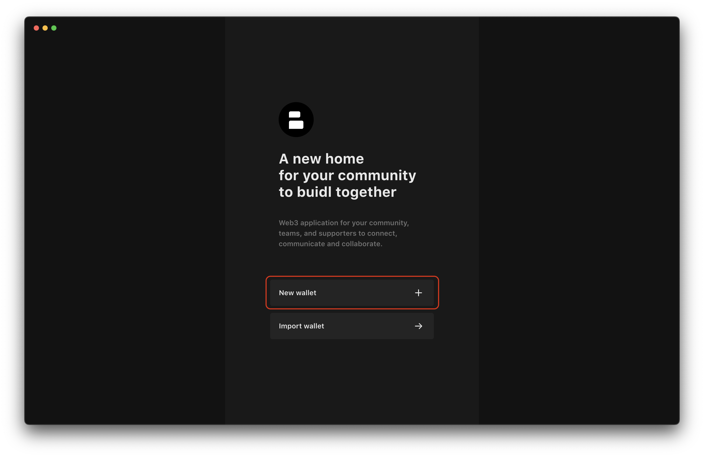
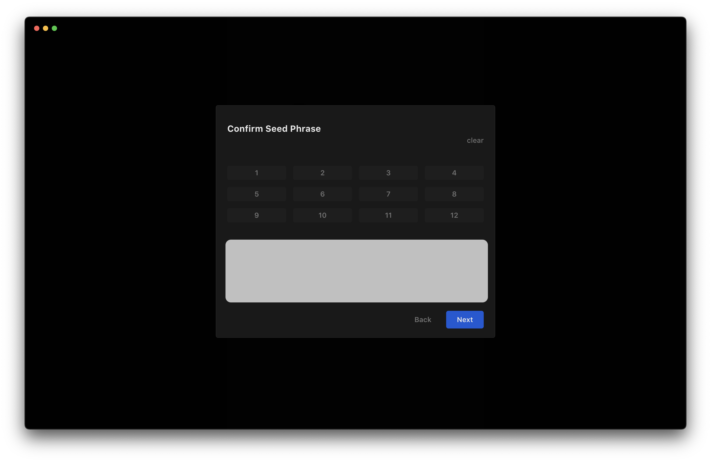

Builder is a web3 native platform that allows you to securely store, send, and receive tokens, NFTs, and cryptocurrencies. In other words, Builder is just a crypto wallet. Just download the Buidler app on [iOS](https://buidler.app/download/ios) or [macOS](https://buidler.app/download/mac) and follow these steps to make a new wallet:

### For iOS

1. Open the Buidler app and click on the **"Create Wallet"** button.

  

**2. Create a password for login on Buidler**. Choose a strong and memorable password. This password will be used to encrypt and decrypt your seed phrase. Learn more about it in [this article](https://docs.buidler.app/docs/blog/how-buidler-store-your-password).

**3. Backup your wallet**. Once you've created your password, you'll be shown a 12-word seed phrase. This acts as your wallet's backup and recovery mechanism. **Make sure to write it down on a piece of paper. Don't share it with anyone.**

**4. Verify your backup (optional)**. Once you've saved your seed phrase, you'll be prompted to confirm it. Type the words in the correct order to make sure you've written down the seed phrase correctly.

**5. Congratulations,** your wallet will be created and you are now a part of the Buidler community.

### For macOS

1. **Open the Buidler app and click on the "Create Wallet" button**.

**2. Create a password for login on Buidler**. Choose a strong and memorable password. This password will be used to encrypt and decrypt your seed phrase. Learn more about it in [this article](https://docs.buidler.app/docs/blog/how-buidler-store-your-password).

    
**3. Backup your wallet**. Once you've created your password, you'll be shown a 12-word seed phrase. This acts as your wallet's backup and recovery mechanism. Make sure to write it down on a piece of paper. Don't share it with anyone

    

**4. Verify your backup (optional)**. Once you've saved your seed phrase, you'll be prompted to confirm it. Type the words in the correct order to make sure you've written down the seed phrase correctly.

    
**5. Congratulations, your wallet will be created and you are now a part of the Buidler community.**
    
    
