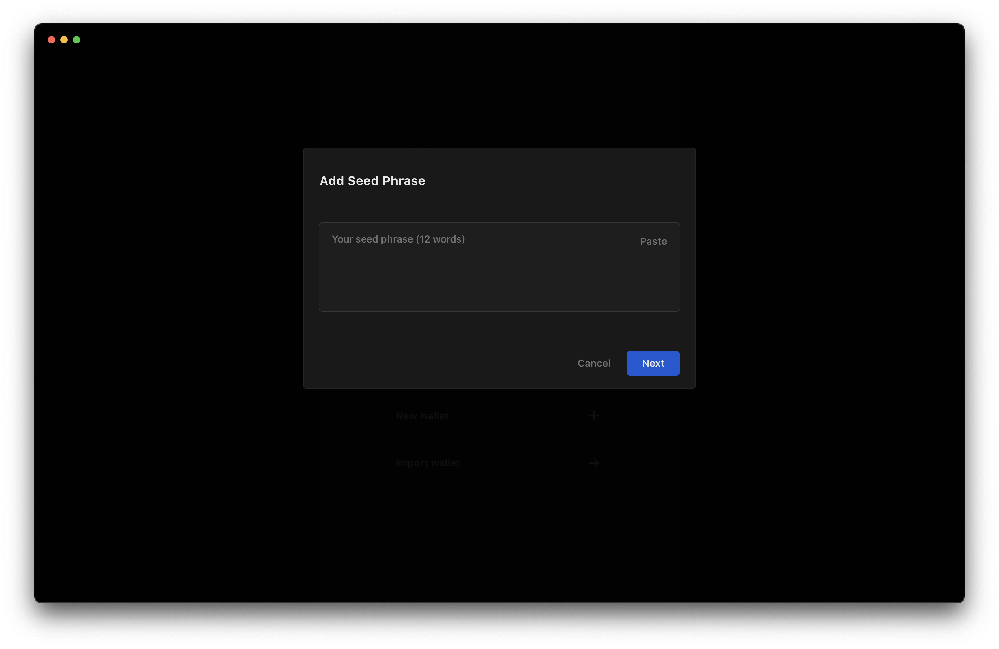

If you already have a wallet, you can import your wallet with a seed phrase or private key on Buidler. The process is straightforward and involves entering your seed phrase or private key into the app.

Download the Buidler app on your [iOS](https://buidler.app/download/ios) or [macOS](https://buidler.app/download/mac) device to get started.

To import wallet on Buidler, follow these steps for your platform:

### For iOS

**1. Open the Buidler app and click on the "Import Wallet" button.**

**2. Enter your seed phrase or private key**. Be sure to double-check the information you're entering to avoid making any mistakes.

**3. Create a password for login on Buidler**. Choose a strong and memorable password. This password will be used to encrypt and decrypt your seed phrase. Learn more about it in [this article](https://docs.buidler.app/docs/blog/how-buidler-store-your-password)

**4. Congratulations,** your wallet will be imported and you are now a part of the Buidler community.

### For macOS

**1. Open the Buidler app and click on the "Import Wallet" button.**

    
**2. Enter your seed phrase or private key**. Be sure to double-check the information you're entering to avoid making any mistakes.

**3. Create a password for login on Buidler**. Choose a strong and memorable password. This password will be used to encrypt and decrypt your seed phrase. Learn more about it in [this article](https://docs.buidler.app/docs/blog/how-buidler-store-your-password)

**4. Congratulations,** your wallet will be imported and you are now a part of the Buidler community.

That's all there is to it! With just a few simple steps, you can import your existing wallet onto the Buidler.