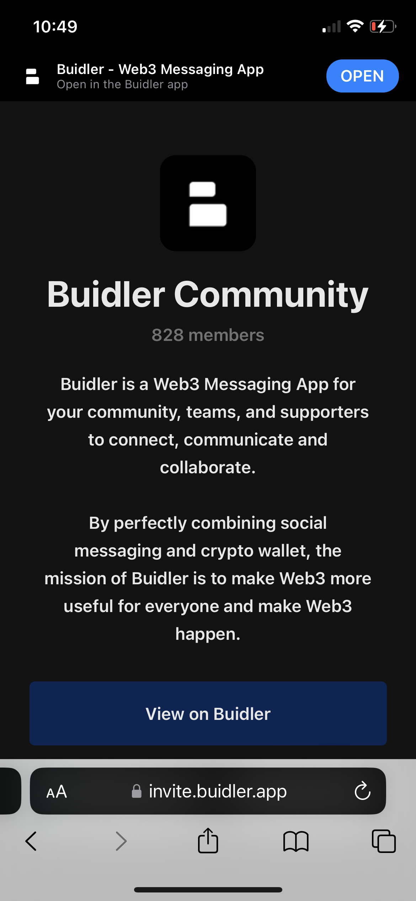
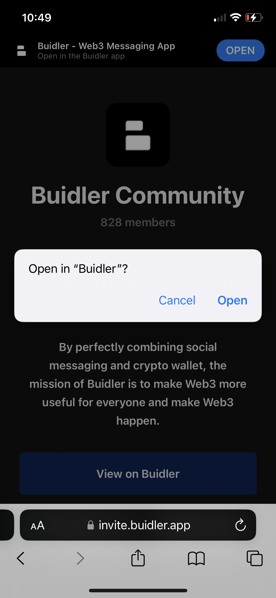
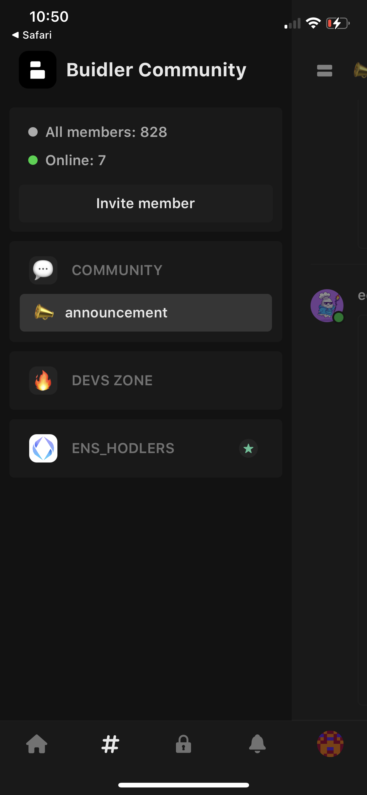
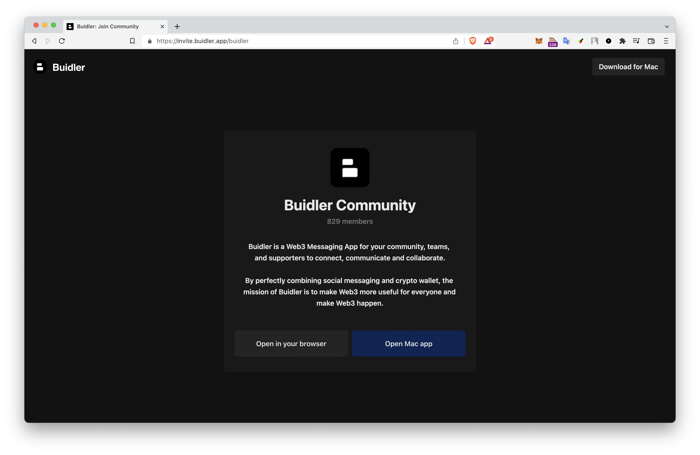
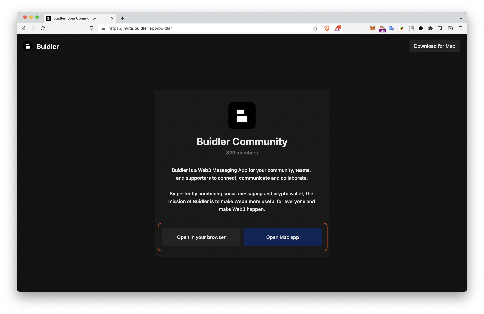
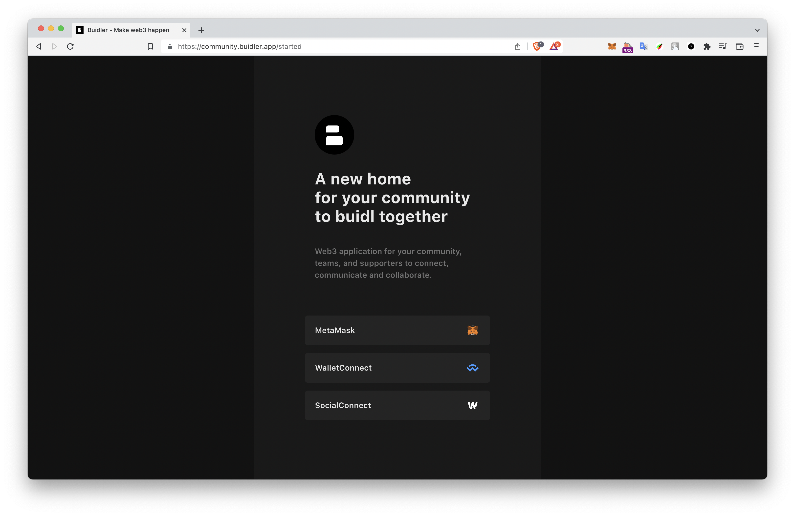
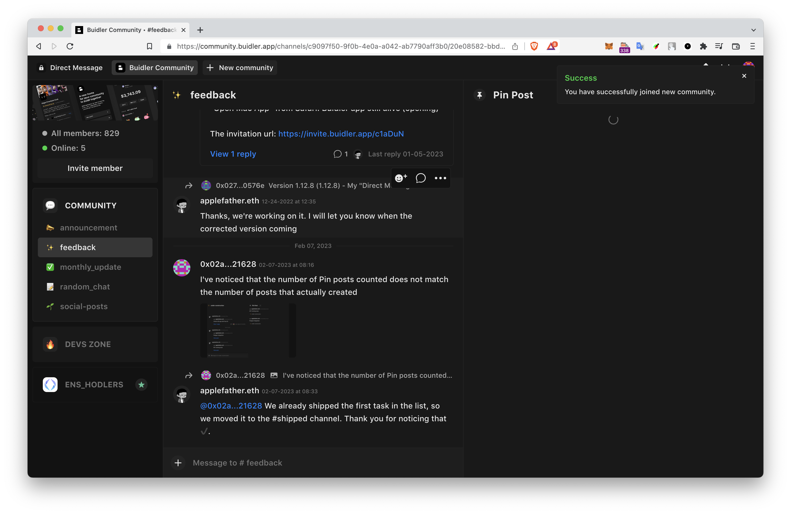
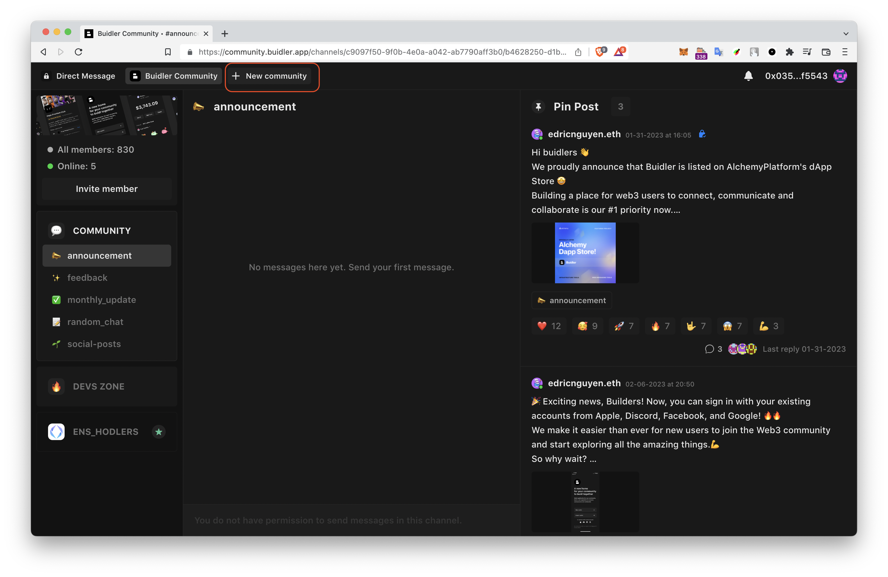
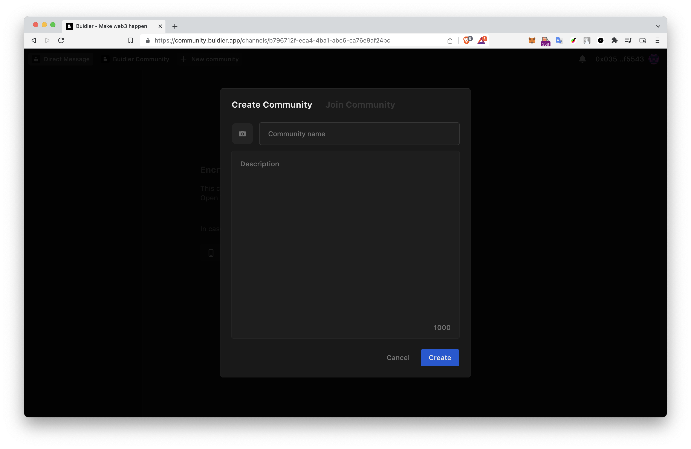
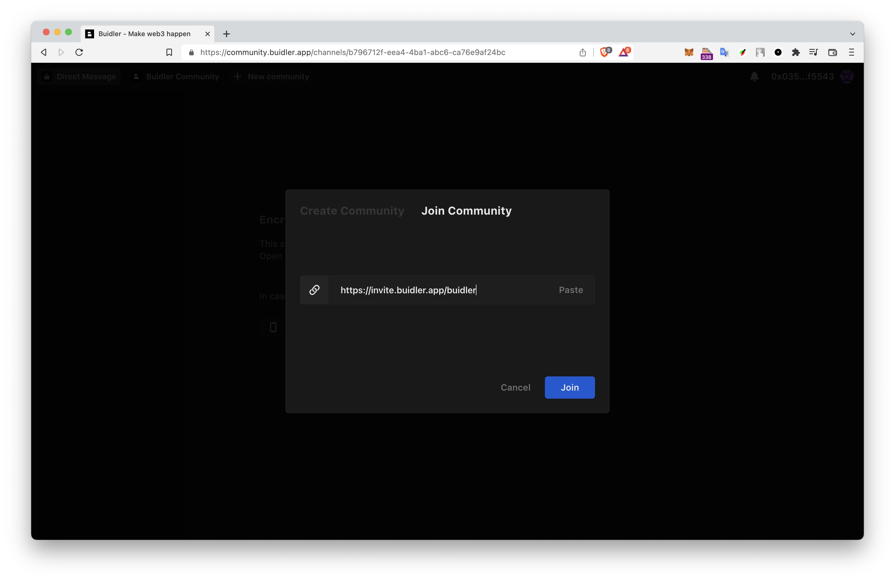

# Join a Community

All you need is an invitation link to the community you want to join.

To participate in the discussions, share your ideas, and connect with like-minded individuals, follow these simple steps to join a community on Buidler:

### For iOS

**1. Open the invitation link on your browser.**
    

**2. Join the community.** Once you have the Buidler app installed, click on the **“View on Builder”** button. Then, it will automatically open and take you to the community.
    

**3. Congratulations!** You are now a member of the community and ready to participate in discussions, share your ideas, and connect with other members.

  

### For macOS and browser

There are 2 ways to do this:

### **Method 1: On the invitation link**

**1. Open the invitation link on your browser.**

    
2. Once you view the details of the invited community, choose either "Open in your browser" or "Open in Mac app", depending on your device.

    
3. If you're not currently logged in to Buidler, you will be prompted to log in. 

4. Once you have successfully logged in, you will be able to join the community and start participating in the community's discussions and activities
    

### Method 2: **On the Buidler app**

**1. Open Buidler app on your browser or Mac device. Then, click on the "New Community" button**

    
**2. A pop-up window will appear, allowing you to create or join a new community.**

    
**3. Select "Join Community"** and paste the invitation link in the “Invitation link” field.

    
**4. Congratulations!** You are now a member of the community and ready to participate in discussions, share your ideas, and connect with other members.

