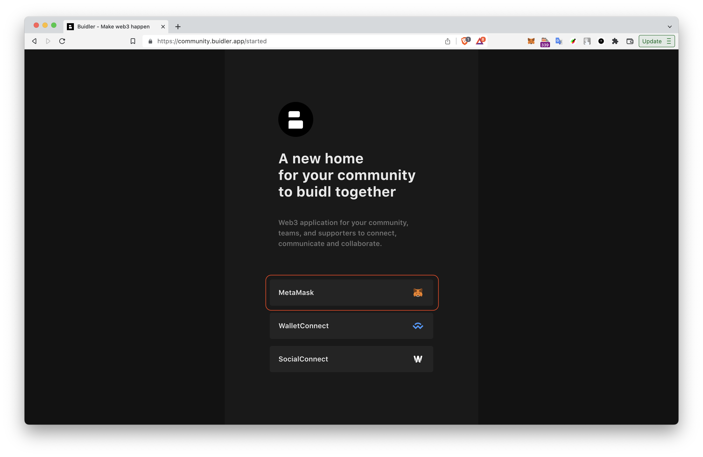
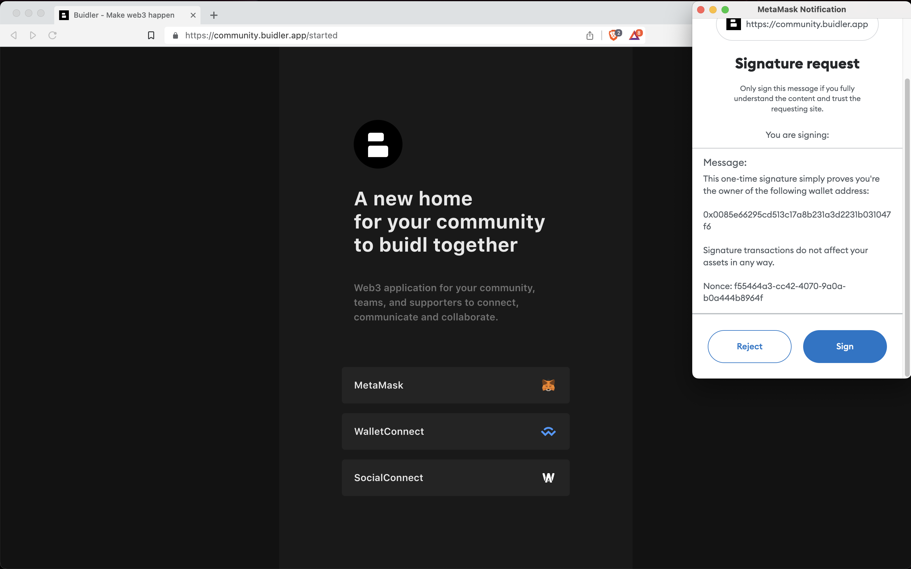
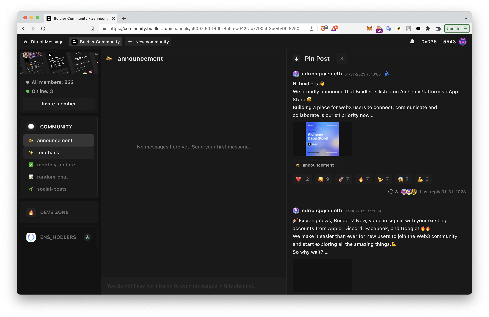
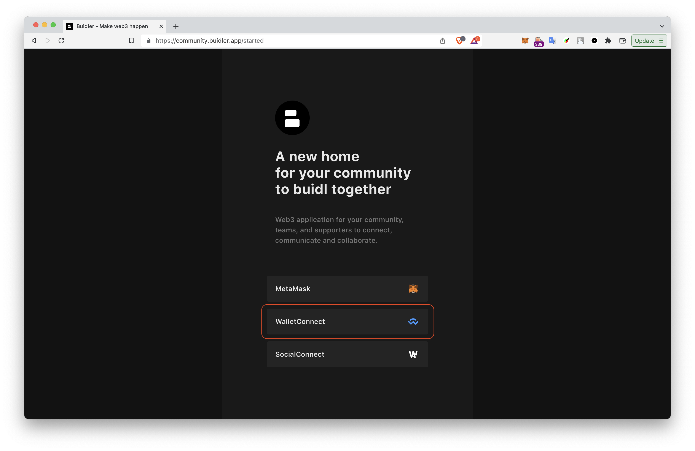
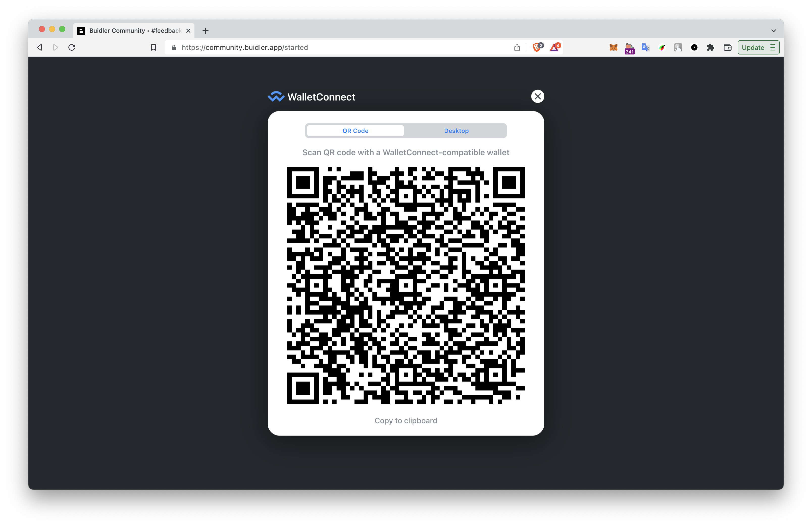
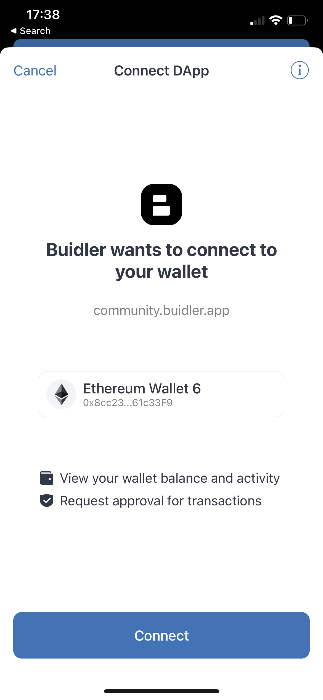
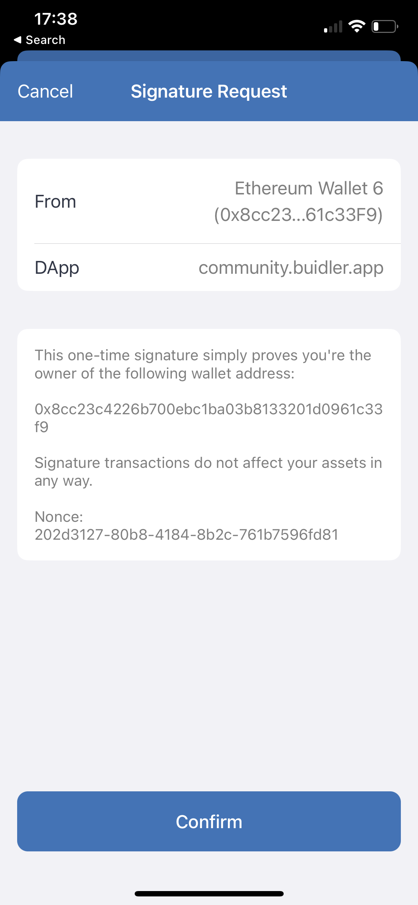

Currently, Buidler only supports connecting through MetaMask and WalletConnect on the browser. This feature enables you to conveniently access and manage your crypto assets within the Buidler platform.

To connect your wallet on Buidler, you'll need to go to the Buidler website at [https://community.buidler.app](https://community.buidler.app)

### MetaMask

**1. On the Buidler site, click on the "MetaMask" button.**

    
**2. Approve the signature request.** Approve the signature request. MetaMask will open and ask you to sign a message; clicking **"Sign"** proves you own the wallet address without any gas fees or transactions.

**3. You are now connected to Buidler through MetaMask**

### WalletConnect

**1. On the Buidler site, click on the "WalletConnect" button.**

    
**2. A QR code will appear on the screen.** Open your mobile wallet app (e.g. MetaMask, TrustWallet, Rainbow) and scan the QR code.
    

    
**3. Approve the connection request.** Your mobile wallet app will display a connection request. Select "Connect" to proceed to the next step.
    

**4. Approve the signature request.** Your mobile wallet app will display a signature request, similar to when you log in with MetaMask. clicking **"Confirm"** proves you own the wallet address without any gas fees or transactions.

**5. You are now connected to Buidler through WalletConnect.**

