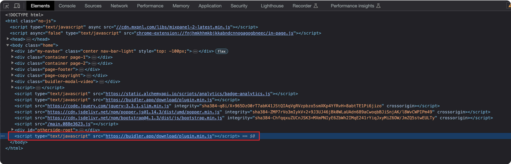
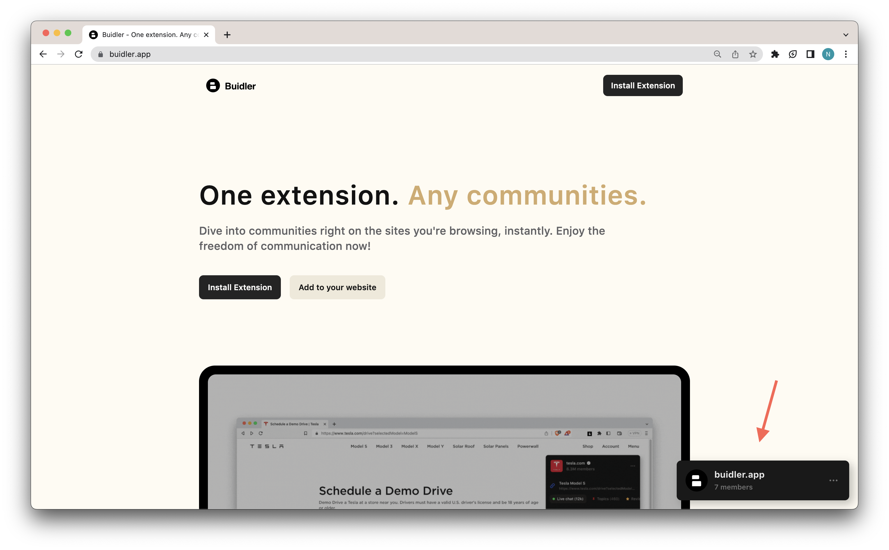

# Add Live Chat To Your Website

By enabling Buidler Live Chat on your website, you can provide your visitors with an easy way to get in touch with you and receive real-time support.

That way, you can build a community of people who are into the same stuff, and they can connect with each other and share their interests. And it's a great way to keep people engaged and coming back to your website. To get it up and running, just follow these simple steps:

1. Copy the following code snippet:

```jsx
<script type="text/javascript" src="https://buidler.app/download/plugin.min.js"></script>
```

2. Paste the code snippet before the closing ```</body>``` tag on every page of your website.



3. Reload your website. Buidler should appear in the bottom right corner.



If you have any questions, please feel free to reach out to our support team through live chat on our website at: https://buidler.app.